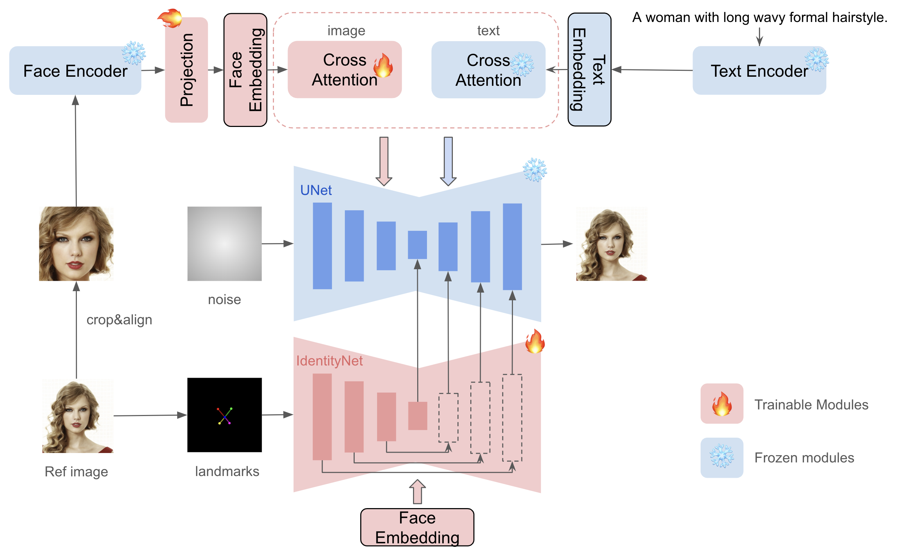

# InstaFace
✨ Этот проект реализует автоматизированную замену лиц с использованием InstantID и ControlNet (5 ключевых точек) в ComfyUI.
Благодаря этому подходу сохраняется идентичность лица, его поза и выражение, а сам процесс не требует дополнительного обучения моделей и ручного создания маски.

Как работает метод?
* **Загрузка изображений** – загружается изображение с позой (pose image) и референсное лицо (face reference).
* **Извлечение идентичности** – InstantID анализирует референсное лицо и создаёт вектор черт лица.
* **Автоматическое создание маски** – вместо ручного выделения области лицо определяется автоматически.
* **Совмещение лица** – ControlNet (5 ключевых точек) корректирует положение лица в соответствии с исходной позой.
* **Генерация результата** – производится реалистичная замена лица с учетом текстуры, освещения и деталей.

Основан на [nosiu/comfyui-instantId-faceswap](https://github.com/nosiu/comfyui-instantId-faceswap), но были добавлены улучшения:

✅ автоматическое создание маски – больше не нужно выделять лицо вручную;

✅ ControlNet (5 ключевых точек) – точное совмещение лица с исходной позой;

✅ улучшенная адаптация лица – более естественное встраивание в сцену.

Решение выглядит следующим образом: 
 


**InstanID** — это оффлайн-подход, который не требует обучения U-Net — можно использовать уже предобученные модели, не тратя ресурсы на переобучение, а также не нужно собирать несколько изображений для fine-tuning, достаточно одного изображения.

## Примеры Работ
| Input Image  | Reference Face | Output |
|-------------|--------------|--------|
|  |  |  |
||  |  |
||  |  |
||  |  |
||  |  |
||  |  |
| |  |  |
||  |  |

## Запуск проекта
1. Установим необходимые зависимости
```bash
python -m venv insta_face
source insta_face/bin/activate
pip install --upgrade pip
pip install -r requirements.txt
```

2. Запустим автоматическое скачивание необходимых весов и файлов проекта
```bash
bash scripts/create_env.sh
```

2. Приступим к работе с ComfyUI:
```bash
python ComfyUI/main.py
```
Далее необходимо перейти в браузер по адресу: http://localhost:8188/,
в интерфейсе ComfyUI нужно нажать **Load Workflow** и выбрать файл workflows/face_swap.json. 

В **Load Image** узлах выбрать:
**Pose Image**  (фото, на котором заменяем лицо) и
**Face Reference** (фото, лицо с которого переносится). Финальным шагом нужно нажать **Queue Prompt** и дождаться завершения обработки.

## Возможные доработки
✅ Добавить анимацию лиц для видео

✅ Оптимизировать процесс для real-time